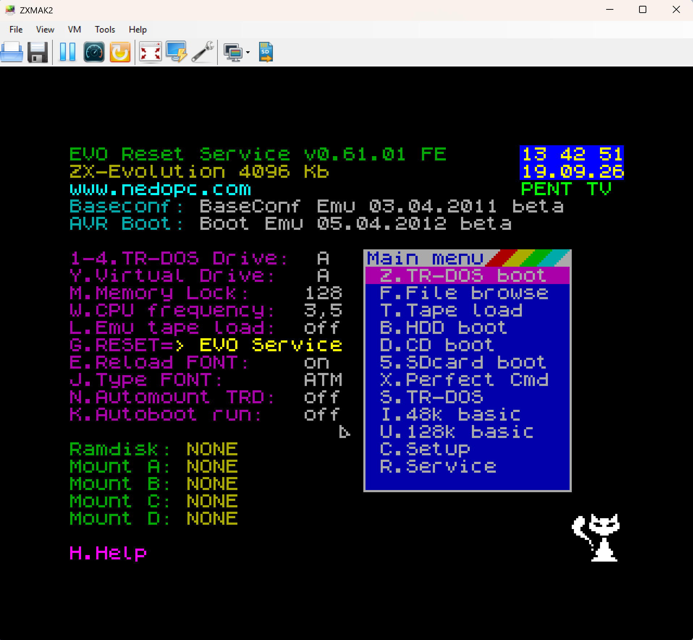

# ZXMAK2 Fork — Extended ZX Evolution Emulator

ZXMAK2 Fork is an extended ZX Evolution emulator for Windows, based on
ZXMAK2 and focused on the ZX Evolution BaseConf platform. It is intended for
running ZX Evolution software, games, operating systems and expansion
hardware in a convenient configurable virtual machine.

The implementation is guided by the official ZX Evolution, NedoPC and chip
manufacturer documentation. Expansion-board registers, ports, operating
modes and conflict rules are modelled from that documentation and from the
latest publicly available board and firmware revisions applicable to the
emulated configuration. The test profile uses compatible current BIOS and ROM
builds for the supported machine configuration.

## Main capabilities

- Configurable CPU speed (3.5, 7 and 14 MHz), memory, TR-DOS, keyboard,
  mouse, joystick, tape and storage devices.
- Two equal ZXBUS slots. A board can be installed in either slot; invalid
  duplicate or conflicting combinations are prevented.
- ZXBUS expansion boards: TurboSound FM Pro, ZX-MultiSound, NeoGS,
  ZXM-MoonSound and ZXNetUSB Rev.C.
- Internal AY/YM sound plus SAA1099, General Sound, SoundDrive, FM, PCM and
  wavetable/OPL4 audio paths provided by the expansion boards.
- Four floppy drives, IDE/HDD, Z-controller SD card, separate NeoGS SD card,
  CD-ROM access through Windows optical drives, and TAP tape playback.
- Clear toolbar media status: green means inserted, red means empty, and grey
  means that the device is unavailable or disabled. Tape, disks, SD cards and
  CD-ROM can be mounted and ejected directly from the toolbar.
- ZXNetUSB Rev.C Ethernet support through a WIZnet W5300 model. TCP, UDP,
  DHCP and DNS use regular Windows networking without TAP drivers, network
  adapter capture or administrator rights, enabling network-aware NedoOS
  software.
- Full Screen, border/no-border display, aspect-preserving, fixed-pixel and
  square-pixel scaling, video filters, antialiasing and hotkeys.
- Warm Reset, CMOS Reset and Factory Reset are available from the VM menu and
  keyboard shortcuts.

The project is continuously checked with CPU, ULA, media, sound-board and
renderer-performance tests. Stable builds are preserved separately, while new
work is developed and tested in isolated branches to retain a reliable
rollback point.

## Current public beta

### ZX Evolution BaseConf Beta 1 — B50

The current public build is **Beta 1**, based on the accepted BaseConf B50
configuration and including the latest supported sound boards, media controls
and ZXNetUSB Rev.C Ethernet support.

[**Download the Beta 1 portable ZIP**](https://github.com/Moro44444444/ZXMAK2-Fork/releases/download/v0.8-beta1/ZXMAK2-ZXEvo-BaseConf-Beta-1.zip)
or read the [Beta 1 release notes](https://github.com/Moro44444444/ZXMAK2-Fork/releases/tag/v0.8-beta1).

The archive has one root folder and excludes personal machine state, mounted
media images, logs, PDB files and the Yamaha YRW801-M instrument ROM. A
legally obtained ROM can be placed beside `ZXMAK2.exe` to enable MoonSound
PCM/wavetable playback. Extract it and run `ZXMAK2.exe`.

Older versions are available in the [Releases archive](https://github.com/Moro44444444/ZXMAK2-Fork/releases).

---

# ZXMAK2 Fork — расширенный эмулятор ZX Evolution

ZXMAK2 Fork — расширенный эмулятор ZX Evolution для Windows, созданный на
основе ZXMAK2 и ориентированный на платформу ZX Evolution BaseConf. Он
предназначен для запуска программ, игр, операционных систем и плат расширения
ZX Evolution в удобной настраиваемой виртуальной машине.

Реализация опирается на официальную техническую документацию ZX Evolution,
NedoPC и производителей микросхем. Регистры, порты, режимы работы и правила
конфликтов плат расширения моделируются по этой документации и последним
доступным публичным ревизиям плат и прошивок, применимым к конфигурации
эмулятора. В тестовой конфигурации используются совместимые актуальные BIOS и
ROM для поддерживаемой машины.

## Основные возможности

- Настройка частоты процессора 3,5 / 7 / 14 МГц, памяти, TR-DOS, клавиатуры,
  мыши, джойстика, ленты и накопителей.
- Два равноправных слота ZXBUS. Плату можно установить в любой слот; ошибочные
  дублирующие или конфликтующие комбинации не допускаются.
- Платы ZXBUS: TurboSound FM Pro, ZX-MultiSound, NeoGS, ZXM-MoonSound и
  ZXNetUSB Rev.C.
- Внутренний звук AY/YM, а также SAA1099, General Sound, SoundDrive, FM, PCM
  и wavetable/OPL4-тракты плат расширения.
- Четыре FDD-дисковода, IDE/HDD, SD-карта Z-controller, отдельная SD-карта
  NeoGS, CD-ROM через оптические приводы Windows и воспроизведение лент TAP.
- Наглядное состояние носителей на панели инструментов: зелёный — вставлен,
  красный — пусто, серый — устройство отключено или недоступно. Ленты, диски,
  SD-карты и CD-ROM монтируются и извлекаются непосредственно с панели.
- Сетевая часть ZXNetUSB Rev.C через модель WIZnet W5300. TCP, UDP, DHCP и DNS
  используют обычную сеть Windows без TAP-драйверов, захвата сетевой карты и
  прав администратора, предоставляя сетевой доступ программам NedoOS.
- Полноэкранный режим, рамка или режим без рамки, масштабирование с сохранением
  пропорций, фиксированный и квадратный пиксель, видеофильтры, антиалиасинг и
  горячие клавиши.
- Warm Reset, CMOS Reset и Factory Reset доступны из меню VM и с клавиатуры.

Проект регулярно проверяется тестами процессора, ULA, носителей, звуковых плат
и производительности рендеринга. Стабильные сборки хранятся отдельно, а новые
возможности разрабатываются и проверяются в изолированных ветках — всегда
остаётся надёжная точка отката.

## Текущая публичная бета-версия

### ZX Evolution BaseConf Beta 1 — B50

Текущая публичная сборка — **Beta 1**, основанная на принятой конфигурации
BaseConf B50. В неё включены последние поддерживаемые звуковые платы, элементы
управления носителями и сетевая поддержка ZXNetUSB Rev.C.

[**Скачать portable ZIP Beta 1**](https://github.com/Moro44444444/ZXMAK2-Fork/releases/download/v0.8-beta1/ZXMAK2-ZXEvo-BaseConf-Beta-1.zip)
или открыть [примечания к выпуску Beta 1](https://github.com/Moro44444444/ZXMAK2-Fork/releases/tag/v0.8-beta1).

В архиве одна корневая папка; личные состояния машины, смонтированные образы,
логи, PDB-файлы и инструментальный ROM Yamaha YRW801-M исключены. Собственную
законно полученную копию ROM можно положить рядом с `ZXMAK2.exe`, чтобы работала
PCM/wavetable-часть MoonSound. Распакуйте архив и запустите `ZXMAK2.exe`.

Предыдущие версии сохранены в [архиве релизов](https://github.com/Moro44444444/ZXMAK2-Fork/releases).

## History

The project was previously hosted on CodePlex:
https://archive.codeplex.com/?p=zxmak2

ZXMAK2 discussions:

- English: https://www.worldofspectrum.org/forums/discussion/39647/
- Russian: http://zx-pk.ru/threads/16830-zxmak2-virtualnaya-mashina-zx-spectrum.html

Earlier emulator history:

- ZXMAK.NET (2005–2008): https://sourceforge.net/projects/zxmak-dotnet/files/zxmak-dotnet/
- ZXMAK (2001–2003): http://zxmak.narod.ru/
