# ZXMAK2 Fork — ZX Evo BaseConf RC1

ZXMAK2 Fork is a Windows emulator focused on ZX Evolution BaseConf. It models
the machine as a configurable virtual system: processor, memory, firmware,
storage, display modes and expansion hardware can be changed without leaving
the emulator.

The implementation follows published ZX Evolution, NedoPC and chip-maker
documentation. Registers, I/O ports, timing modes, board revisions and
conflict rules are implemented from those specifications. The maintained
configuration uses current compatible BIOS and ROM images.

## Screenshots / Скриншоты

<table>
<tr>
<td>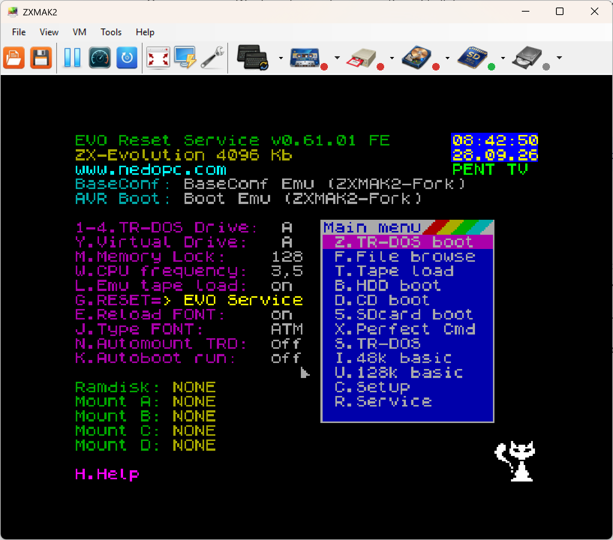</td>
<td>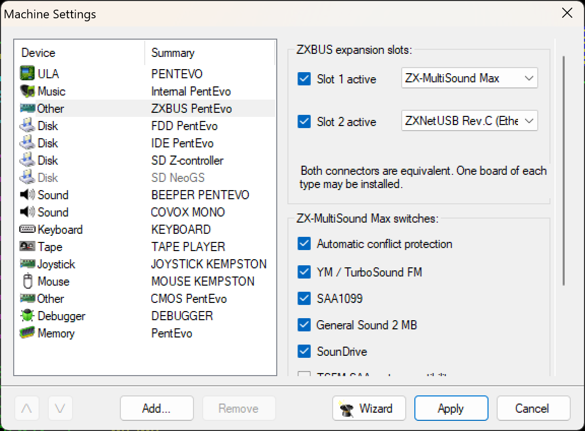</td>
</tr>
<tr>
<td>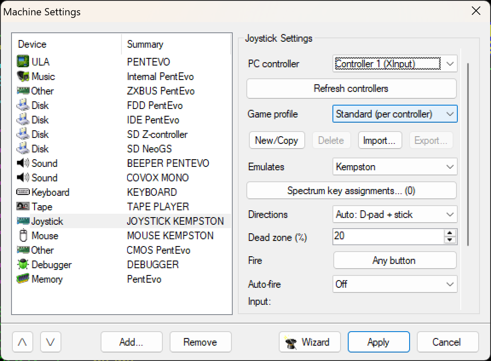</td>
<td>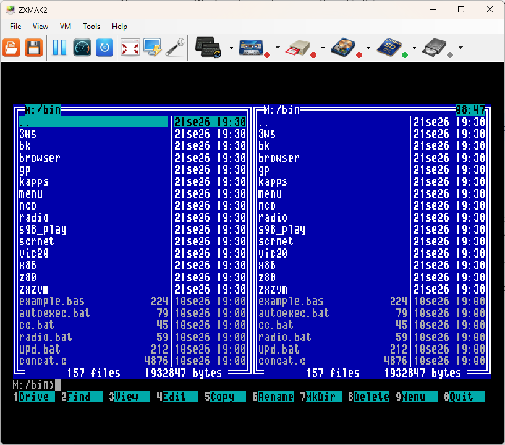</td>
</tr>
<tr>
<td>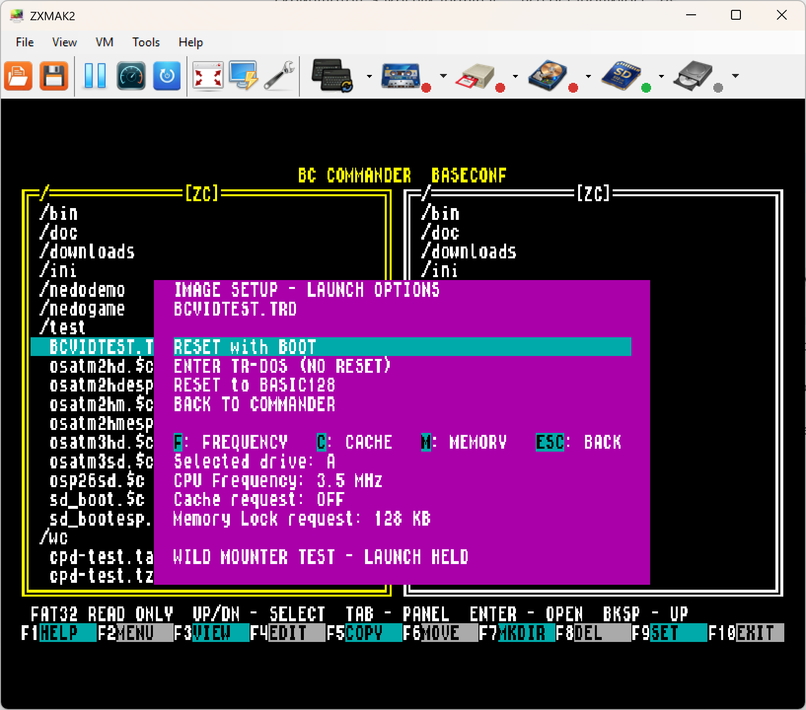</td>
<td>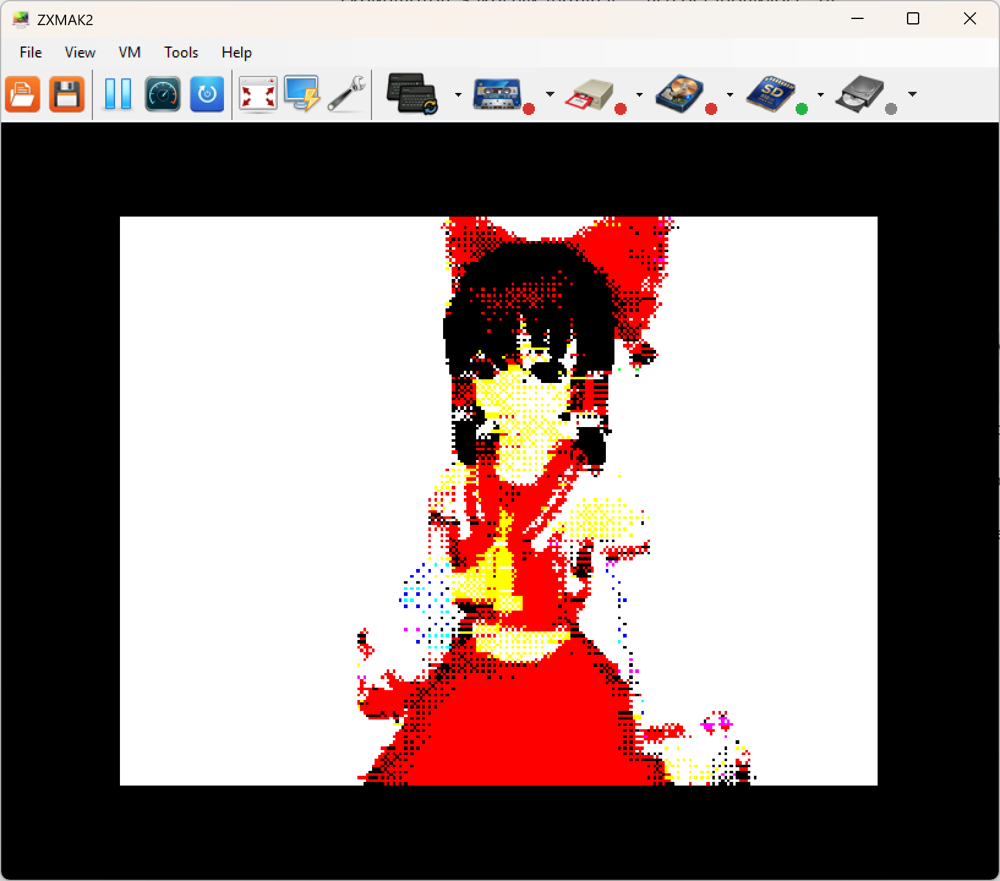</td>
</tr>
<tr>
<td>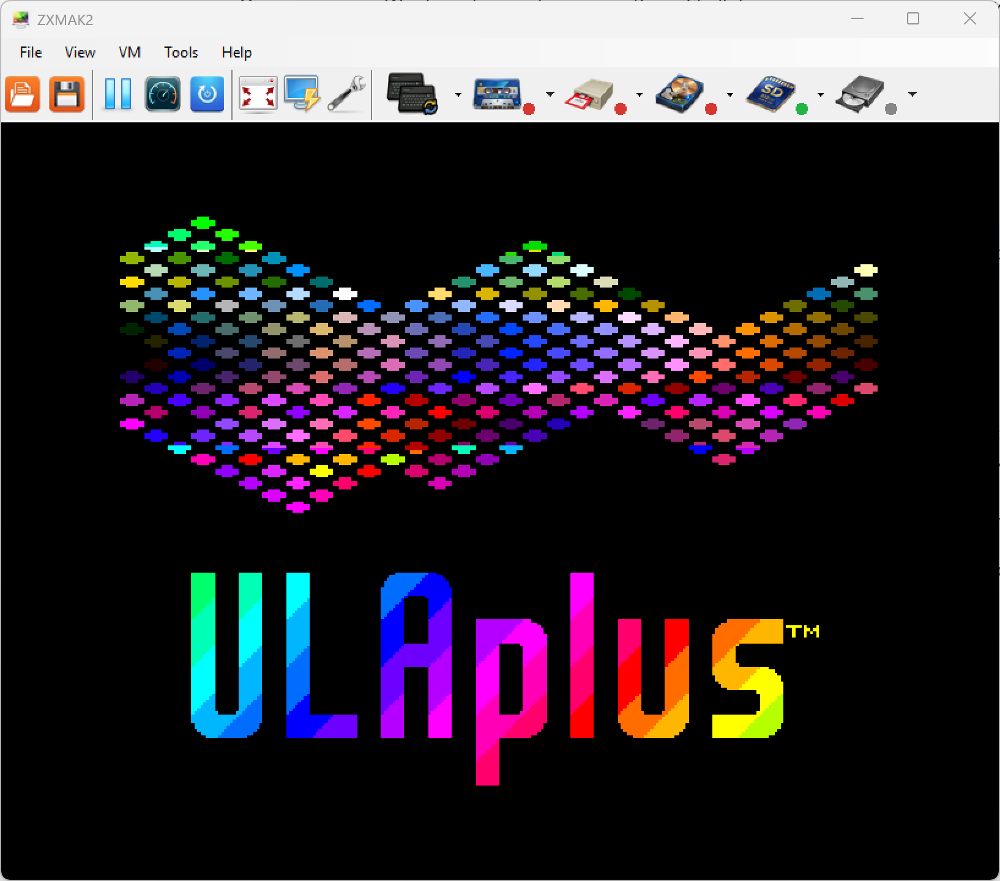</td>
<td>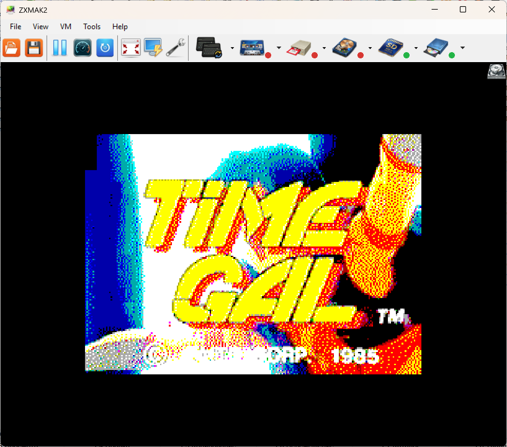</td>
</tr>
<tr>
<td>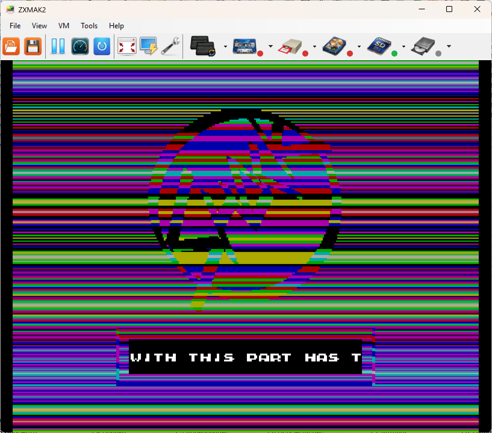</td>
<td>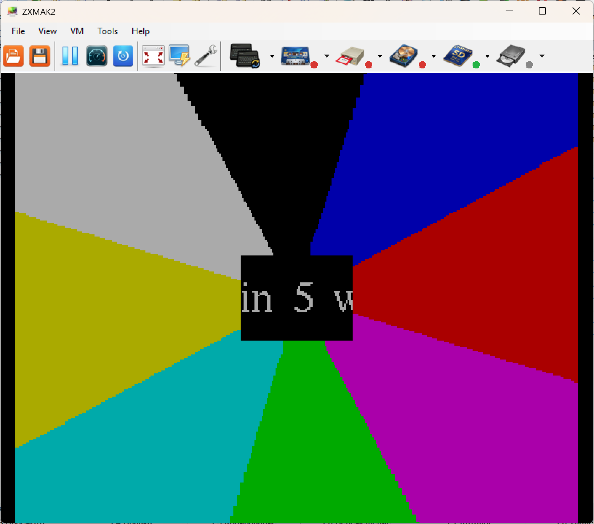</td>
</tr>
<tr>
<td>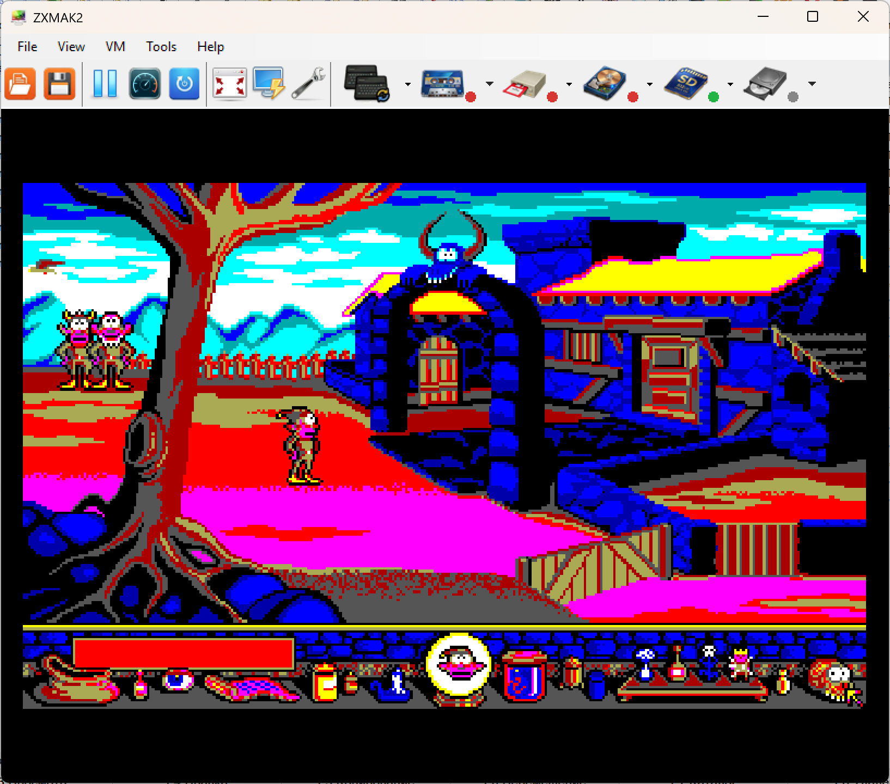</td>
<td>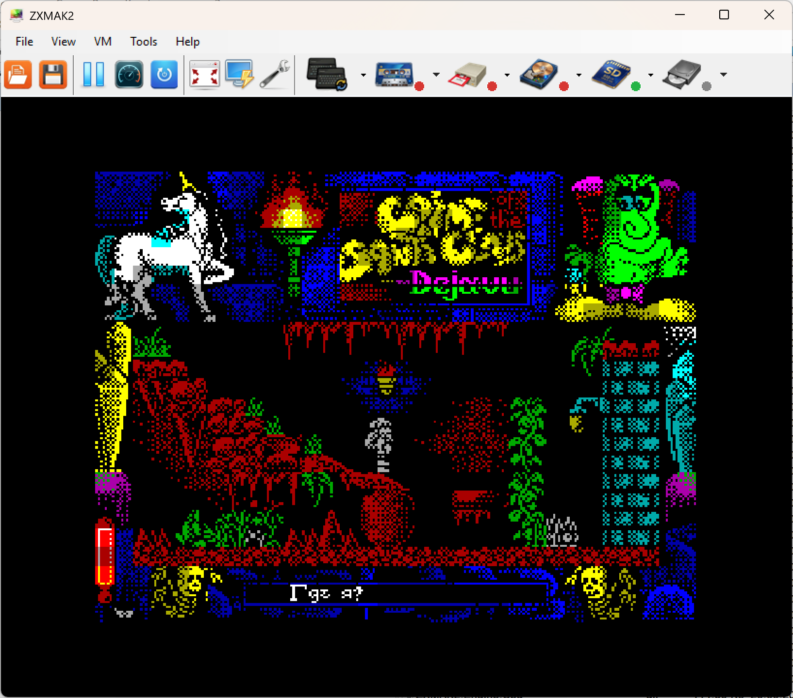</td>
</tr>
</table>

## ZX Evolution BaseConf capabilities

- 3.5, 7 and 14 MHz CPU modes; configurable memory, TR-DOS, keyboard, mouse,
  joystick, tape and reset behaviour.
- Optional **ULAplus** compatibility. When it is enabled in ULA settings,
  supporting software selects the 64-colour palette automatically; disabling
  it retains standard Spectrum video.
- Two equivalent ZXBUS slots. Boards can be placed in either slot, while
  duplicate and incompatible combinations are rejected.
- Four floppy drives, IDE/HDD, Z-controller SD, independent NeoGS microSD,
  CD-ROM access through Windows optical drives, TAP playback and mounting or
  ejecting media from the toolbar.
- ZXNetUSB Rev.C with WIZnet W5300, TCP, UDP, DHCP and DNS through regular
  Windows networking; no TAP driver, network-adapter capture or administrator
  rights are required.
- Full Screen (`Alt+Enter`), border/no-border display, scaling modes, video
  filters, antialiasing, Master Volume, configurable PC joystick mapping,
  Warm Reset, CMOS Reset and Factory Reset.

## Sound hardware

| Board | Emulated facilities |
| --- | --- |
| **Neo General Sound (NeoGS C-VS)** | General Sound, MOD, MP3, VS1011 and its own microSD card. |
| **TurboSound FM Pro Rev.C** | Dual YM2203 with FM and SAA1099. |
| **ZX-MultiSound Rev.A2** | Two YM2203, SAA1099, General Sound, SoundDrive and MIDI. |
| **ZX-MultiSound Max** | MultiSound facilities plus 2 MB General Sound and OPL2/OPL3 playback, including VGM. |
| **ZXM-MoonSound Rev.01** | YMF278B OPL4, PCM/wavetable playback, YRW801-M ROM and sample RAM. |
| **ZX OmniSound Virtual** | A virtual universal card combining NeoGS, MultiSound audio, MIDI, SoundDrive, Max-compatible OPL2/OPL3/VGM and MoonSound OPL4 in one ZXBUS slot. |

The emulator models the board interfaces and prevents hardware-port conflicts.
Sound output is mixed with per-board calibration and a Master Volume control.
`ZX OmniSound Virtual` has a 40% output increase as part of its single final
mix stage.

## Current release

[**ZXMAK2 Fork — ZX Evo BaseConf RC1**](https://github.com/Moro44444444/ZXMAK2-Fork/releases/tag/v1.0-rc1)
is the current portable release for the ZX Evo BaseConf RC1 configuration.

The archive excludes personal machine state, mounted media, logs, PDB files
and the Yamaha YRW801-M instrument ROM. Place a legally obtained YRW801-M ROM
beside `ZXMAK2.exe` to enable MoonSound PCM/wavetable playback.

Stable builds and working states are retained as rollback points. CPU, ULA,
media, sound-board and renderer tests accompany the development work.

---

# ZXMAK2 Fork — ZX Evo BaseConf RC1

ZXMAK2 Fork — эмулятор для Windows, ориентированный на ZX Evolution BaseConf.
Машина моделируется как настраиваемая виртуальная система: процессор, память,
прошивки, накопители, видеорежимы и платы расширения меняются прямо в
эмуляторе.

Реализация опирается на опубликованную документацию ZX Evolution, NedoPC и
производителей микросхем. Регистры, порты, режимы, ревизии плат и правила
конфликтов воспроизводятся по этой документации. В поддерживаемой конфигурации
используются совместимые актуальные BIOS и ROM.

## Возможности ZX Evolution BaseConf

- Режимы процессора 3,5 / 7 / 14 МГц, настраиваемые память, TR-DOS,
  клавиатура, мышь, джойстик, лента и сброс машины.
- Опциональная совместимость с **ULAplus**. При включении в настройках ULA
  программа сама выбирает 64-цветную палитру; в выключенном состоянии работает
  стандартное Spectrum-видео.
- Два равноправных слота ZXBUS. Плату можно ставить в любой слот, а дублирующие
  и несовместимые комбинации не допускаются.
- Четыре FDD-дисковода, IDE/HDD, SD Z-controller, независимая microSD NeoGS,
  CD-ROM через оптические приводы Windows, TAP и загрузка/извлечение носителей
  с панели инструментов.
- ZXNetUSB Rev.C с WIZnet W5300, TCP, UDP, DHCP и DNS через обычную сеть
  Windows без TAP-драйверов, захвата сетевого адаптера и прав администратора.
- Полноэкранный режим (`Alt+Enter`), рамка/без рамки, масштабирование,
  видеофильтры, антиалиасинг, Master Volume, настройка PC-джойстика, Warm
  Reset, CMOS Reset и Factory Reset.

## Звуковое оборудование

| Плата | Эмулируемые возможности |
| --- | --- |
| **Neo General Sound (NeoGS C-VS)** | General Sound, MOD, MP3, VS1011 и собственная microSD-карта. |
| **TurboSound FM Pro Rev.C** | Два YM2203, FM и SAA1099. |
| **ZX-MultiSound Rev.A2** | Два YM2203, SAA1099, General Sound, SoundDrive и MIDI. |
| **ZX-MultiSound Max** | Возможности MultiSound, General Sound 2 МБ и OPL2/OPL3, включая VGM. |
| **ZXM-MoonSound Rev.01** | YMF278B OPL4, PCM/wavetable-воспроизведение, ROM YRW801-M и sample RAM. |
| **ZX OmniSound Virtual** | Виртуальная универсальная плата: NeoGS, звук MultiSound, MIDI, SoundDrive, OPL2/OPL3/VGM как у Max и OPL4 MoonSound в одном слоте ZXBUS. |

Эмулятор моделирует интерфейсы плат и предотвращает конфликты аппаратных
портов. Звук смешивается с калибровкой уровней отдельных плат и общей
регулировкой Master Volume. У `ZX OmniSound Virtual` прибавка выхода 40%
выполняется один раз на окончательном микшировании.

## Текущий выпуск

[**ZXMAK2 Fork — ZX Evo BaseConf RC1**](https://github.com/Moro44444444/ZXMAK2-Fork/releases/tag/v1.0-rc1)
— текущая portable-версия конфигурации ZX Evo BaseConf RC1.

Из архива исключены личные состояния машины, смонтированные носители, логи,
PDB-файлы и инструментальный ROM Yamaha YRW801-M. Законно полученную копию
YRW801-M можно положить рядом с `ZXMAK2.exe`, чтобы работала PCM/wavetable
часть MoonSound.

Стабильные сборки и рабочие состояния сохраняются как точки отката. В ходе
разработки выполняются тесты процессора, ULA, носителей, звуковых плат и
производительности рендеринга.

## History

The project was previously hosted on CodePlex:
https://archive.codeplex.com/?p=zxmak2

ZXMAK2 discussions:

- English: https://www.worldofspectrum.org/forums/discussion/39647/
- Russian: http://zx-pk.ru/threads/16830-zxmak2-virtualnaya-mashina-zx-spectrum.html

Earlier emulator history:

- ZXMAK.NET (2005–2008): https://sourceforge.net/projects/zxmak-dotnet/files/zxmak-dotnet/
- ZXMAK (2001–2003): http://zxmak.narod.ru/
